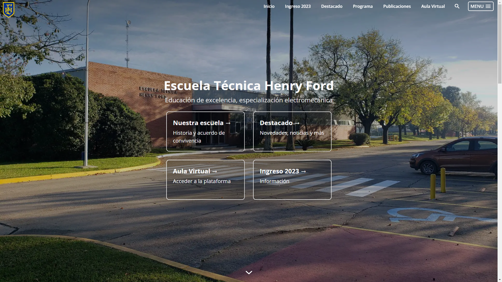
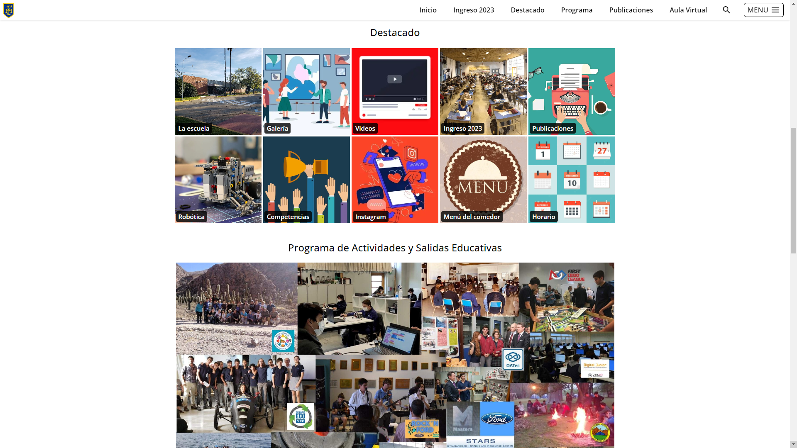

# ethf-web-page

# This repo is outdated. Continue at: [https://github.com/EscuelaTecnicaHenryFord/ethf-web-page](https://github.com/EscuelaTecnicaHenryFord/ethf-web-page)

## This is the web page of "Escuela de Educación Técnica Henry Ford". [https://www.henryford.edu.ar/](https://www.henryford.edu.ar/)

Its made with next-js and strapi

It has the abaility to add pages, and posts. Posts can be organized into different categories

